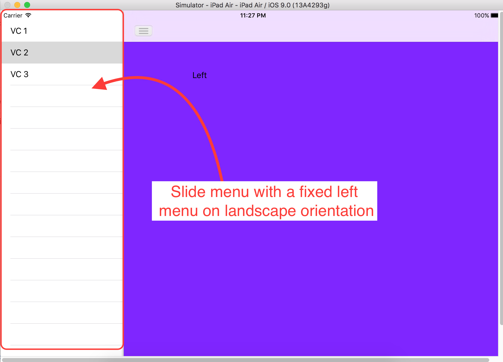

AMSlideMenu  
===========

Sliding Menu for iOS by <b> arturdev </b> and adapted by <b>Douglas Frari</b> 

This project is a <b>FORK</b> to adapt the original component <a href="https://github.com/SocialObjects-Software/AMSlideMenu">AMSlideMenu</a> to support similar functionality to SplitManager (Master / Details) iPAD.

With this library you can create one sliding menu, changed to support the approach iPAD like SplitManager (using Master / Details) 

Features:

1. Slide menu with <b>left</b> menu only.   
2. Slide menu with a <b>fixed left</b> menu on landscape orientation; 
3. Support device orientation landscape e portrait like the approach of Master/Detail on iPad;
4. This keeps the original behavior AMSlideMenu component for Portrait orientation or run with an iPhone device.

